# 🍎 Ứng Dụng Bán Trái Cây - Fruitly (apbantraicay)

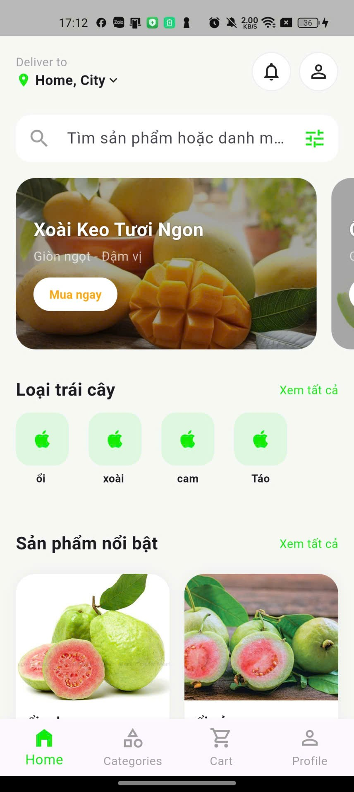

Dự án **Fruitly** là một giải pháp thương mại điện tử hoàn chỉnh cho cửa hàng trái cây, bao gồm ứng dụng di động cho người dùng (Flutter) và hệ thống quản trị mạnh mẽ (Web-based PHP Admin).

---

## ✨ Tính Năng Nổi Bật

### 👤 Giao diện Người dùng (Mobile App - Flutter)
- **Xác thực:** Đăng nhập, đăng ký tài khoản nhanh chóng.
- **Mua sắm:** Trang chủ sinh động, tìm kiếm thông minh, xem chi tiết và chọn khối lượng sản phẩm.
- **Thanh toán:** Giỏ hàng tiện lợi, áp dụng Voucher giảm giá, hỗ trợ COD và Ví điện tử.
- **Cá nhân:** Lịch sử đơn hàng, quản lý địa chỉ, hệ thống hạng thành viên.

### 🛡️ Giao diện Quản trị (Admin Dashboard - PHP)
- **Thống kê:** Dashboard theo dõi doanh thu 7 ngày qua và tổng số đơn hàng.
- **Quản lý sản phẩm:** Thêm mới, cập nhật giá và tồn kho trái cây.
- **Quản lý danh mục:** Phân loại trái cây theo nhóm dễ dàng.
- **Quản lý đơn hàng:** Tiếp nhận và cập nhật trạng thái đơn hàng của khách.
- **Quản lý khuyến mãi:** Tạo và quản lý các mã giảm giá (Voucher).
- **Quản lý người dùng:** Quản lý danh sách khách hàng đăng ký hệ thống.
- **Quản lý nhân viên:** Quản lý đội ngũ nhân sự và phân quyền quản trị.

---

## 📸 Hình Ảnh Minh Họa

### 📱 Giao diện Ứng dụng (Mobile)

| Đăng nhập | Trang chủ | Chi tiết sản phẩm | Giỏ hàng |
|:---:|:---:|:---:|:---:|
| 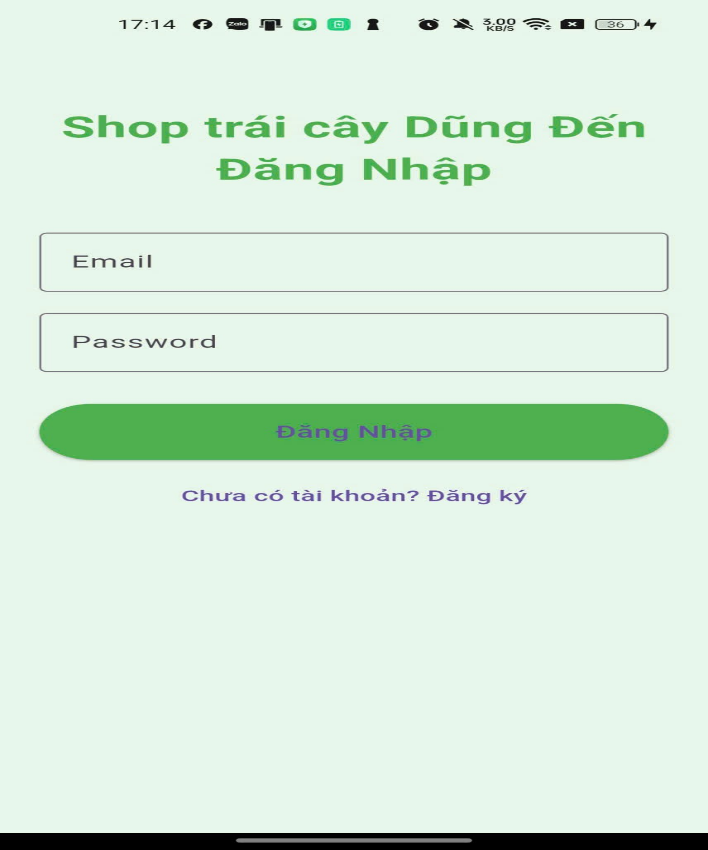 |  | 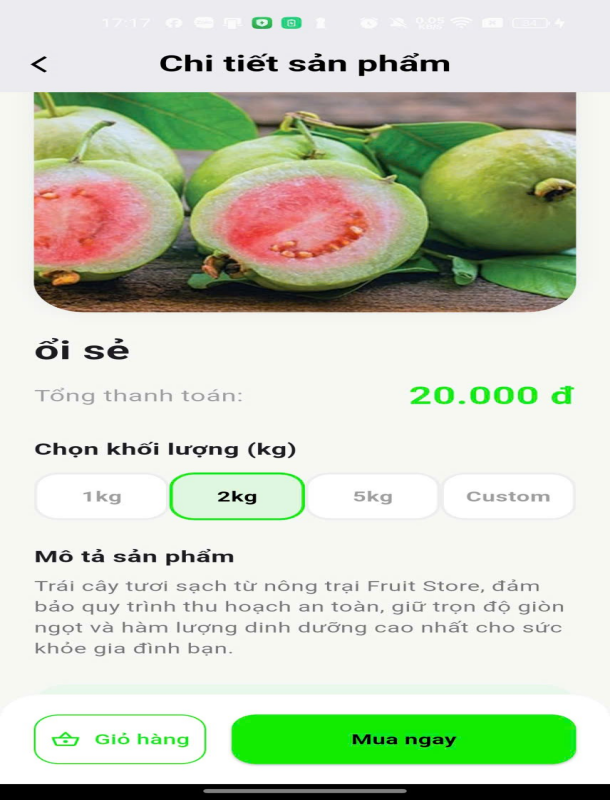 | 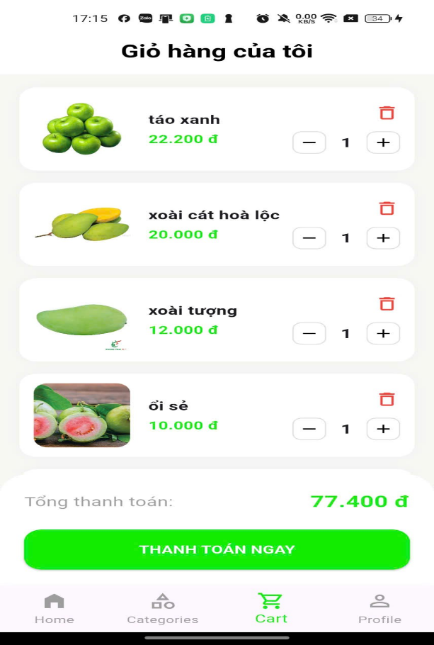 |

| Tìm kiếm | Hồ sơ cá nhân | Lịch sử mua hàng | Địa chỉ nhận hàng |
|:---:|:---:|:---:|:---:|
| 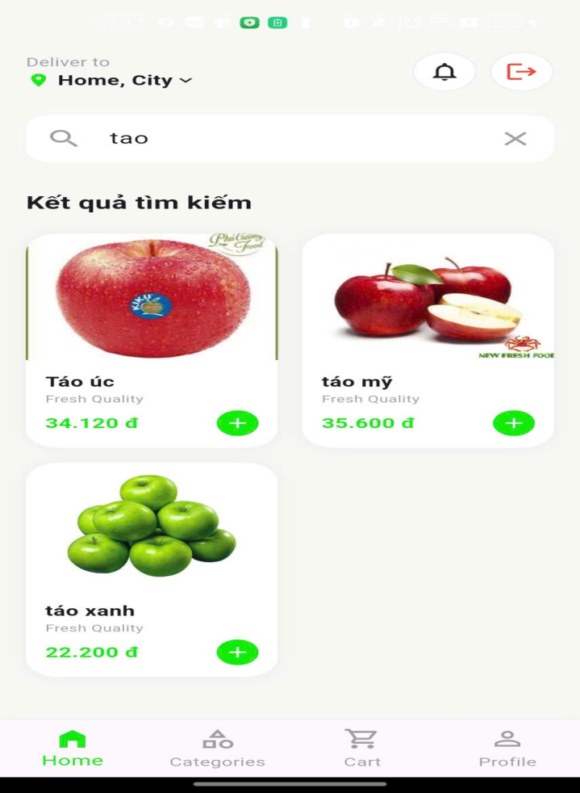 | 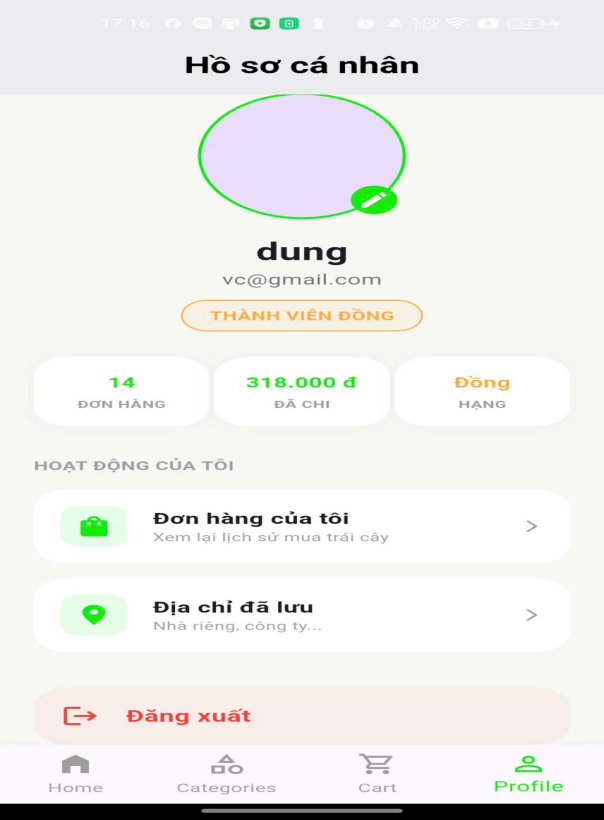 | 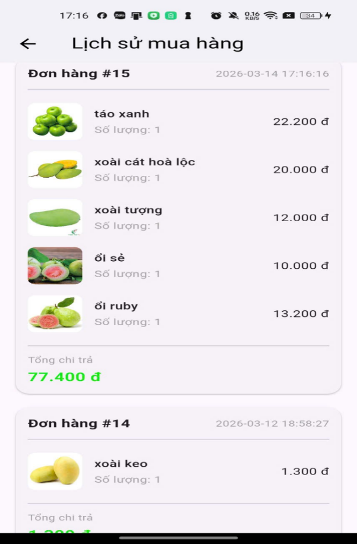 | 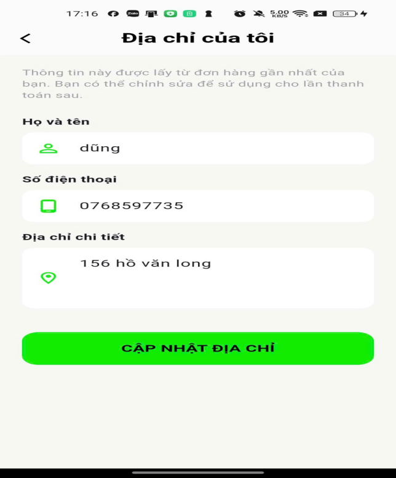 |

### 💻 Giao diện Quản trị (Web PHP)

| Trang Thống kê | Quản lý sản phẩm | Quản lý danh mục |
|:---:|:---:|:---:|
| 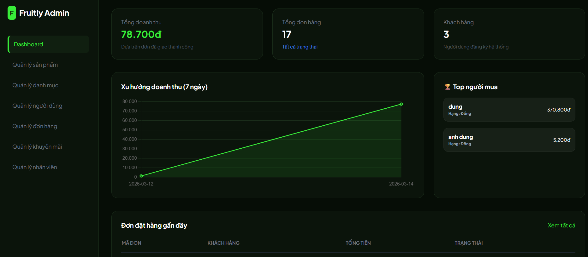 | 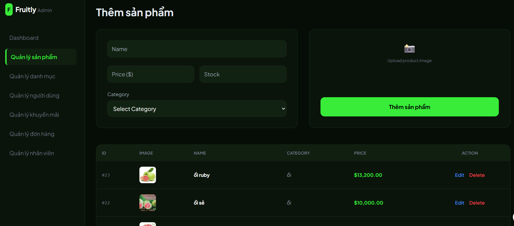 | 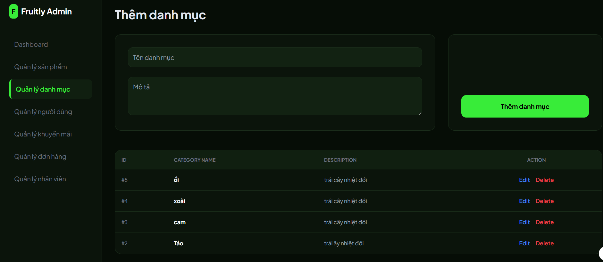 |

| Quản lý đơn hàng | Quản lý khuyến mãi | Quản lý người dùng |
|:---:|:---:|:---:|
| 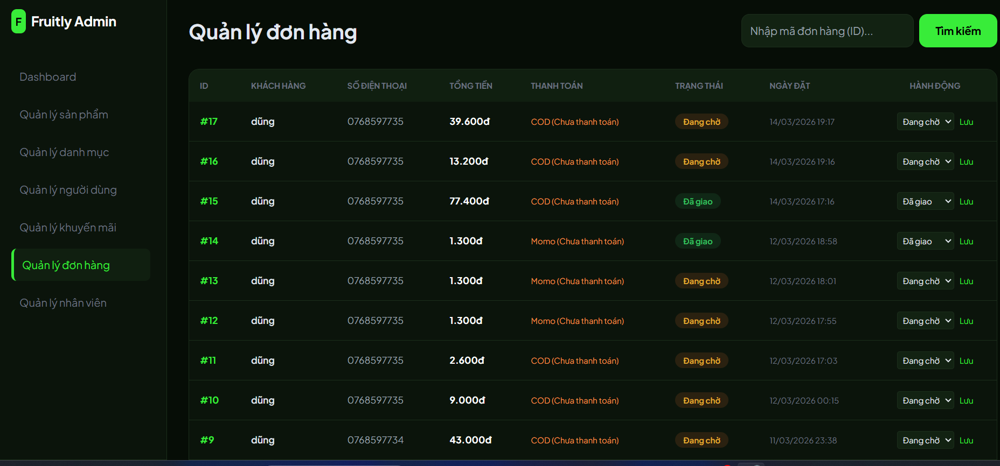 | 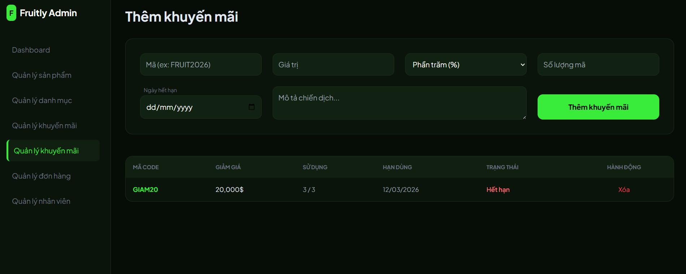 | 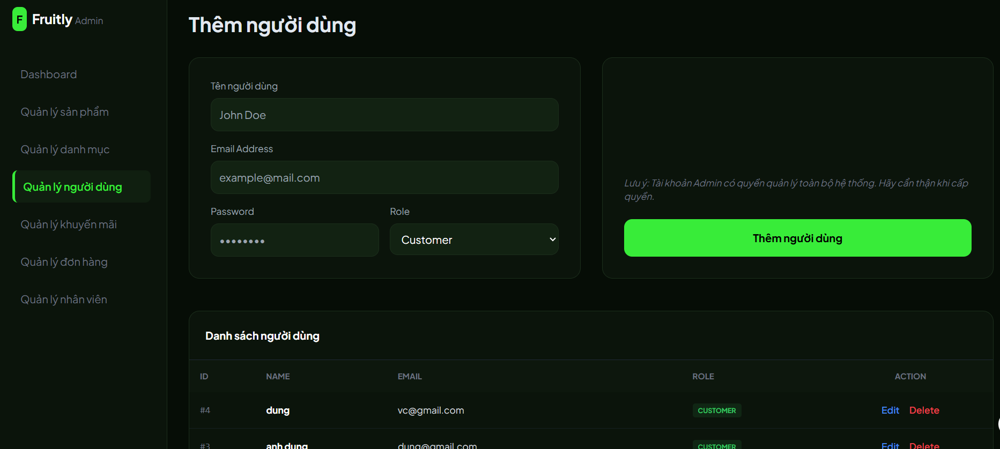 |

| Quản lý nhân viên |
|:---:|
| 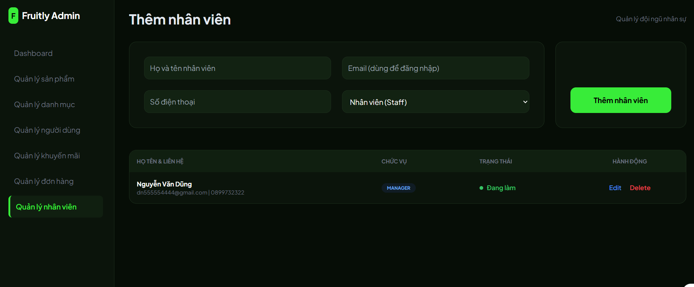 |

---

## ⚙️ Hướng Dẫn Cài Đặt và Kết Nối

1. **Chuẩn bị Backend:** Chạy Apache & MySQL (XAMPP/Laragon). Import database vào MySQL.
2. **Thiết lập ngrok:** Chạy lệnh `ngrok http 80` để lấy URL kết nối internet cho Server Local.
3. **Cấu hình App:** Cập nhật URL ngrok vào file cấu hình API trong dự án Flutter.
4. **Chạy ứng dụng:** Chạy lệnh `flutter run` trên thiết bị giả lập hoặc máy thật.

---
*Phát triển bởi Team Phát triển Ứng dụng Di động.*
